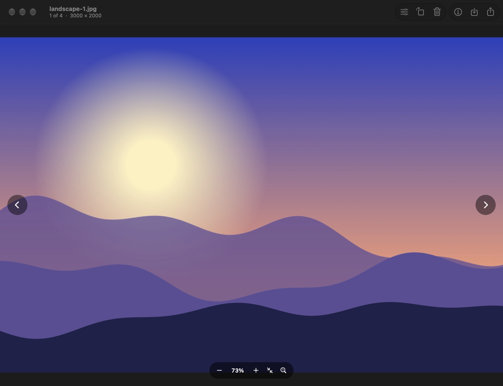
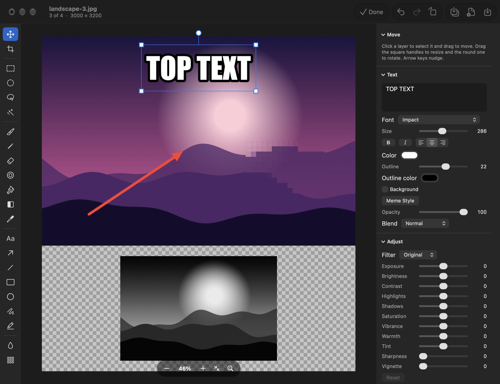

# Pixix

A fast image viewer and layered editor for macOS. It opens instantly, leaves the Dock when its window closes,
flips through a folder like Windows 11 Photos, converts and resizes in one dialog, and edits with layers like
Paint.NET. It can also take screenshots: select a part of the screen, mark it up on the spot, copy or save.
And it picks colors from anywhere on the screen, under a magnifier.



## Install

Requires macOS 26 or later on Apple Silicon.

Paste this into Terminal. It downloads the latest release into Applications, clears the flag that makes macOS
refuse apps from the internet, and opens Pixix:

```sh
curl -L https://github.com/fedorananin/Pixix/releases/latest/download/Pixix.zip -o /tmp/Pixix.zip \
  && rm -rf /Applications/Pixix.app \
  && ditto -x -k /tmp/Pixix.zip /Applications \
  && xattr -dr com.apple.quarantine /Applications/Pixix.app \
  && open /Applications/Pixix.app
```

Or by hand:

1. Download `Pixix.zip` from the [latest release](https://github.com/fedorananin/Pixix/releases/latest) and
   unpack it.
2. Move `Pixix.app` to the Applications folder.
3. Run this once in Terminal, otherwise macOS says the app cannot be verified and will not open it:

   ```sh
   xattr -dr com.apple.quarantine /Applications/Pixix.app
   ```

4. Open Pixix.

The command is needed because Pixix is not notarized by Apple: notarization requires a paid developer account,
and this is a free hobby project. The command only removes the "downloaded from the internet" mark from this one
app. If you would rather not use Terminal, try to open the app once, then go to **System Settings › Privacy &
Security** and press **Open Anyway**.

To make Pixix open your pictures by default, go to **Pixix › Settings** and press **Open Images with Pixix**.
**Restore Previous Apps** in the same place hands the types back; macOS asks you to confirm each file type
separately, so expect a dialog per type. For a single type it is quicker to select such a file in Finder,
choose **File › Get Info**, pick the app under **Open With** and press **Change All**.

## Viewing

| Action | How |
|---|---|
| Next, previous image | `←` `→`, the on-screen arrows, a two-finger horizontal swipe, the side buttons of a mouse, the mouse wheel anywhere off the picture, a sideways wheel |
| First, last image | `Home`, `End` |
| Zoom | Pinch, the mouse wheel over the picture, `+` `−`, `⌘+` `⌘−` |
| Fit, actual size | Double click, `0` / `1`, `⌘0` / `⌘1` |
| Pan a zoomed image | Drag, or two fingers |
| Full screen | `F` |
| Play or pause an animation | `Space`; `,` and `.` step frame by frame |
| Rotate the file | `⌘R`, `⌘L` |
| Move to Trash | `⌘⌫` or `Delete`; `⌘Z` brings it back |
| Rename | `F2` |
| Duplicate, copy to a folder, move to a folder | `⇧⌘D`, `⌃⌘C`, `⌃⌘M`; all can be undone |
| Select and copy text in the picture | Drag over it, then `⌘C`. **View › Live Text** (`⇧⌘T`) turns this on and off |
| Info, with a histogram and a link to the place in Maps | `⌘I` |
| Another window on the same picture | `⌥⌘N` |
| Thumbnail strip | `⌥⌘T` |
| Slideshow | `⇧⌘↩` |

Opening one file browses its whole folder. Opening several browses just those. Opening or dropping a folder
browses the pictures in it. Each picture opened from Finder gets a window of its own; **Settings** can make
them share one instead. A right click on the picture brings up the commands for the file.

## Saving and converting

| Command | Shortcut | What it does |
|---|---|---|
| Save | `⌘S` | Overwrites the file being edited, in its own format. The first Save of a session leaves the file as it was in the Trash |
| Save As… | `⇧⌘S` | Saves a copy; the original is untouched |
| Save as Pixix Project… | `⌥⇧⌘S` | Saves a `.pixix` project that keeps the layers |
| Export… | `⇧⌘E` | Format, size, quality, with the resulting file size shown live |
| Export Again | `⌘E` | Repeats the last export next to the original, no questions |

Formats written: JPEG, PNG, WebP, HEIC, AVIF, TIFF, GIF, BMP. Animated GIF, WebP and APNG convert into each
other with all frames. Everything macOS can decode is read, including RAW, PSD and JPEG XL.

## Editing



Press **Edit** (`⌘↩`). The left strip holds the tools, the right panel their options, the layer's properties,
adjustment sliders, the layer list and the history.

- **Crop** (`C`): free or fixed ratio, straighten, and drag the frame past the edge to extend the canvas.
- **Markup**: arrow (`A`), line, rectangle (`R`), ellipse (`U`), pen (`P`), highlighter (`H`), text (`T`),
  speech bubble (`Y`), numbered badge (`Q`), blur area (`J`), pixelate area (`K`), spotlight (`Z`), which
  darkens everything around an area. These stay editable objects until rasterized, and text and shapes can
  cast a shadow.
- **Text** is typed straight onto the picture: click with the text tool and type; click text that is already
  there to change it. Each click of the badge tool adds the next number.
- **Painting**: brush (`B`), pencil (`N`), eraser (`E`), clone stamp (`S`), paint bucket (`G`), gradient (`D`),
  color picker (`I`).
- **Selections**: rectangle (`M`), ellipse (`O`), lasso (`L`), magic wand (`W`). Shift adds, Option subtracts.
  **Edit › Select Subject** (`⇧⌘A`) selects what the picture is of, and **Layer › Remove Background** leaves
  only that.
- **Layers**: drop or paste a picture to add it as a layer; move, resize and rotate it with the Move tool (`V`).
  **Layer › Add Image Below** (`⌥⌘B`) and **Add Image to the Right** extend the canvas and put a picture there,
  scaled to fit. In the layer list, drag a layer onto another to reorder and double-click a name to change it.
- **Image**, **Adjustments** and **Effects** menus: resize, canvas size, rotate, flip, levels, curves, blurs,
  noise, distortions and more, each with a live preview.

Hold `Space` to pan. `X` swaps the two colors. `[` and `]` change the brush size.

## Screenshots

Off by default. Turn on **Settings › Screenshots › Take screenshots with Pixix**, and allow Pixix under
Privacy & Security › Screen & System Audio Recording when macOS asks. Pixix then keeps an icon in the menu bar
and stays there after its windows are closed, without a Dock icon, so the shortcut works at any time.

To change the shortcut, click it in Settings and press the new one: a key with `⌘`, `⌥` or `⌃`, or a function
key. `Esc` keeps the old one and `Delete` removes it.

Press the shortcut (`⇧⌘2` unless you chose another) and the screen freezes:

| To | Do this |
|---|---|
| Select an area | Drag. The size in pixels is shown at its corner |
| Take a window, or the whole display | Click the window; click the desktop or press `⌘A` |
| Adjust the selection | Drag its corners and edges; arrow keys move it by a pixel, ten with `⇧` |
| Hold it to proportions, or give it an exact size | The `≡` menu in the size label; or type over the numbers |
| See what a button does | Hold the pointer over it |
| Mark it up | The panel beside it: arrow, line, pen, highlighter, rectangle, ellipse, pixelate, blur, text, numbered badges, color and line width. A button with a corner holds more tools: click it again |
| Move what you drew, or the selection itself | The pointer tool (`V`): drag the markup, or drag bare screen |
| Copy | `⌘C` or `Return` |
| Save | `⌘S` saves to the folder chosen in Settings (`~/Pictures/Screenshots`); `⇧⌘S` asks where |
| Copy the text in the selection | `⇧⌘C` |
| Continue in the full editor | `⌘E`. The markup arrives as layers, still editable |
| Back out | `Esc` or a right click |

The proportions, the tool, the color and the line width are remembered for the next screenshot. **Start Pixix
at login** in Settings keeps the shortcut working after a restart. `⌘Q` quits Pixix entirely, shortcut
included. macOS keeps its own `⇧⌘3`, `⇧⌘4` and `⇧⌘5` and acts on them before any app can; to give one of them
to Pixix, switch it off in System Settings › Keyboard › Keyboard Shortcuts › Screenshots. Settings says so when
the shortcut you chose is one macOS still uses.

Releases are signed ad hoc, so macOS may ask for the Screen Recording permission again after an update.

Utilities that quit an app when its last window closes, such as DockDoor with that option on, do not take
Pixix out of the menu bar: while screenshots or the color picker are on, Pixix turns their request down.

## Color picker

Off by default, and separate from screenshots: turn on **Settings › Color Picker › Pick colors from the screen
with Pixix**. It needs the same Screen Recording permission, and keeps Pixix in the menu bar the same way. The
shortcut is `⇧⌘1` unless you record another.

Press the shortcut and the screen freezes. A magnifier follows the pointer: the pixels around it enlarged, the
one in the middle framed, and its color written underneath as HEX, RGB and HSL.

| To | Do this |
|---|---|
| Take the color | Click, or press `Return` |
| Hit an exact pixel | The arrow keys move by one pixel, ten with `⇧` |
| Do the other thing with it | Click with `⌥` held |
| Back out | `Esc` or a right click |

What a click does is chosen in Settings. **Copies the color** puts one value on the clipboard, in the notation
picked under **Copy as**. **Opens a window with its values** shows the color in a small floating window with
every notation and a button to copy each; **Pick Another** there picks again into the same window.

| Notation | Copied as |
|---|---|
| HEX | `#1A2B3C`, or `1A2B3C` with **Write HEX without the #** |
| RGB | `rgb(26, 43, 60)` |
| RGB 0–1 | `0.102, 0.169, 0.235`, the fractions Swift, Core Graphics and shaders take |
| HSL | `hsl(210, 40%, 17%)` |
| HSB | `hsb(210, 57%, 24%)` |
| OKLCH | `oklch(28.3% 0.039 249.3)` |

**Show** in Settings chooses which of them appear, in the magnifier and in the window alike; HEX, RGB and HSL
do at first. The values are sRGB whatever the display is, so a color picked from a web page reads as the page
wrote it.

## Building from source

You need macOS 26 or later with Xcode 27 or its Command Line Tools (Swift 6.4). Xcode itself is optional.

```sh
git clone https://github.com/fedorananin/Pixix.git
cd Pixix
Scripts/build-app.sh             # build ~/Library/Caches/Pixix/dist/Pixix.app
Scripts/build-app.sh --install   # also copy it to /Applications and make it the default image viewer
Scripts/run.sh photo.jpg         # build, then open a picture
swift test --scratch-path ~/Library/Caches/Pixix/build
```

An app you build yourself needs no `xattr` command. `--install` also makes Pixix the default app for every
image type it reads and remembers the apps that had them; add `--keep-defaults` to skip that.
`Pixix --restore-default` undoes it, with one macOS confirmation dialog per file type.

The script signs with the certificate named in `PIXIX_SIGN_IDENTITY`, or one called `Local Dev` if your
keychain has it, or ad hoc otherwise. With an ad hoc signature macOS asks for folder access again after every
rebuild; a self-signed code signing certificate avoids that. Build output never lands in the project folder.

Every push is built and tested by [GitHub Actions](.github/workflows/build.yml). Pushing a tag such as `v0.1.0`
publishes a release with `Pixix.zip` attached.

### Layout

```
Sources/CWebP/        vendored libwebp 1.6.0, used only to write WebP
Sources/PixixCodec/   reading, writing, metadata, export
Sources/PixixEngine/  document, layers, selection, history, rendering, painting
Sources/Pixix/        the app: viewer, editor, export dialog, screenshots, color picker
Tests/                Swift Testing suites for the codec and the engine
Resources/            Info.plist and the icon
Scripts/              build-app.sh, run.sh, make-icon.swift, make-sample.swift
```

[PLAN.md](PLAN.md) holds the design and what is and is not done. [AGENTS.md](AGENTS.md) holds the rules for
working on the code, including for AI coding agents.

### Diagnostics

The binary accepts a few switches when run from a terminal:

```sh
APP=~/Library/Caches/Pixix/dist/Pixix.app/Contents/MacOS/Pixix
$APP --make-default                                     # open every supported file type with Pixix
$APP --restore-default                                  # give them back; macOS asks to confirm each type
$APP --timing --quit photo.jpg                          # milliseconds to the first frame
PIXIX_TRACE=1 $APP --timing --quit photo.jpg            # the same, with launch checkpoints
$APP --snapshot out.png photo.jpg                       # a picture of the viewer window
$APP --snapshot out.png --edit --demo meme photo.jpg    # a picture of the editor after a scripted scenario
$APP --snapshot out.png --demo capture photo.jpg        # the screenshot overlay, with the picture standing in for the screen
$APP --snapshot out.png --demo picker photo.jpg         # the color picker's magnifier, on the same stand-in
$APP --background                                       # with screenshots switched on: start in the menu bar, with no window
$APP --snapshot out.png --memory photo.jpg              # also print how much memory the app holds by then
```

The timing and snapshot runs are unattended: the window is kept off the screen, the app does not come to
the front, and it quits without asking about anything.

`swift Scripts/make-sample.swift photo.jpg` draws a sample picture to try these on.

## Author and license

Made by [Fedor Ananin](https://github.com/fedorananin). Source: <https://github.com/fedorananin/Pixix>.

Released under the [MIT License](LICENSE): use it, change it, ship it, sell it — just keep the copyright notice.
libwebp, bundled in `Sources/CWebP`, is under its own BSD-style license; see `Sources/CWebP/licenses`.
